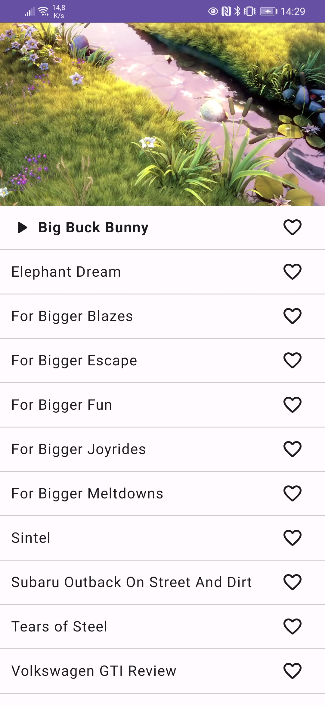
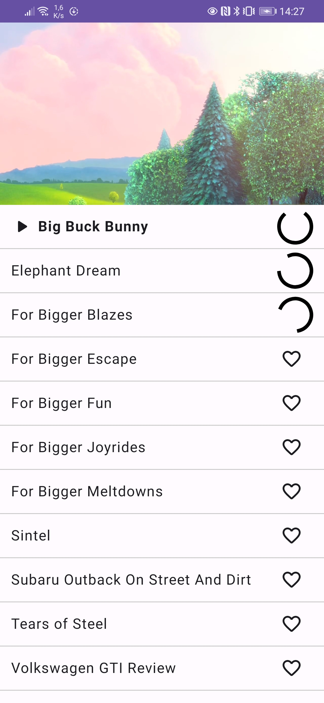
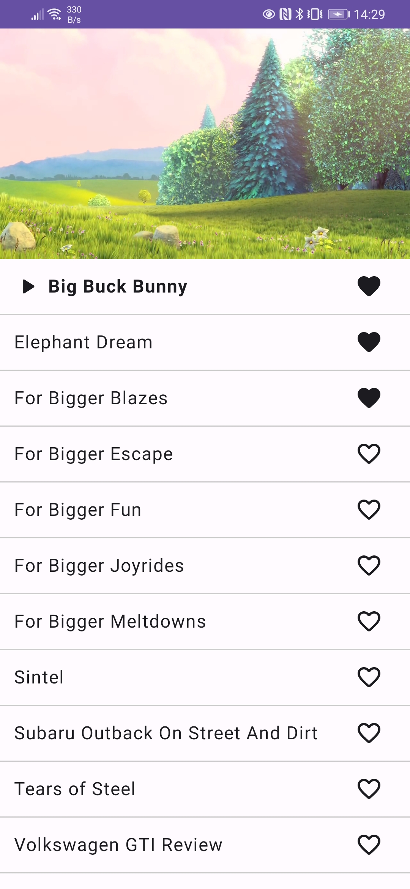
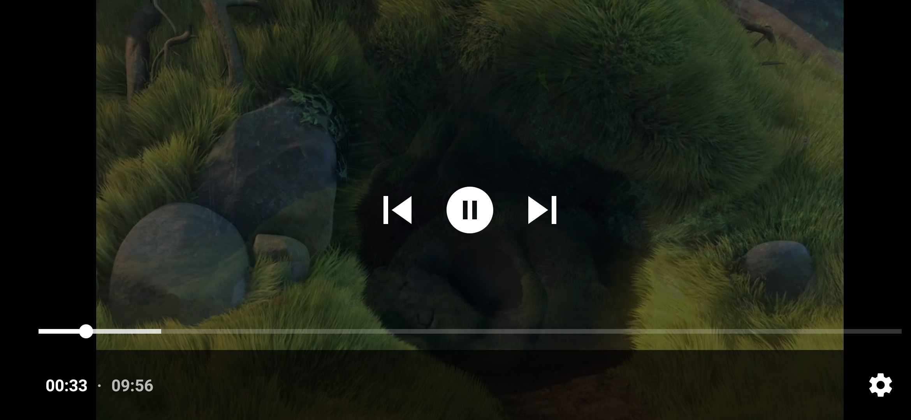

# Video App

Simple app built around the Media3 Exoplayer library. The app allowed you to stream videos from a predifined playlist. Videos can also be made available offline.

## Feature
- Video streaming
- Video download for offline playback
- Background download
- Fullscreen
- Gestures for fastforward, backward and fullscreen

## Screenshot
| Home | Downloading | Offline |
|------|------|------|
|  |  |  |

| FullScreen |
|-----|
  |

## Architecture
- CLEAN
- MVVM
- Modularization

## Tech stack
- Kotlin
- Compose + Material 3
- Coroutine + Flow
- Exoplayer
- Room
- Hilt